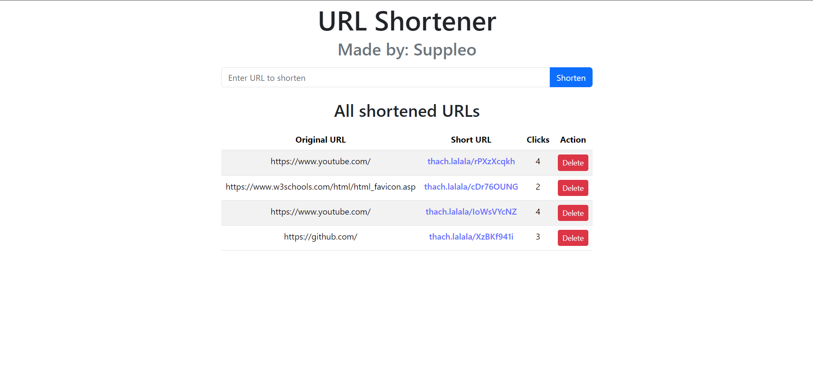
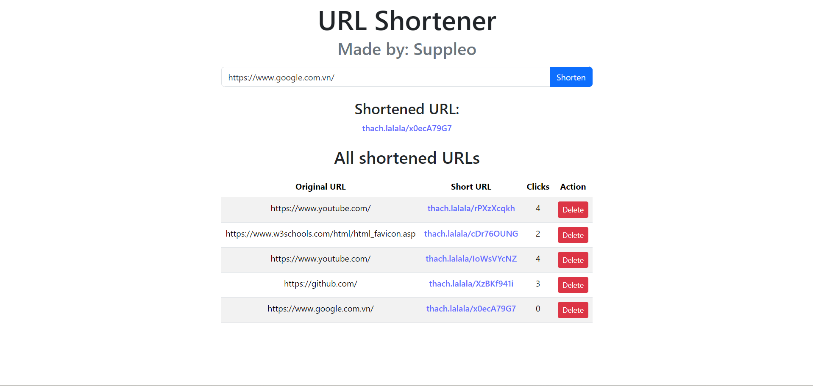
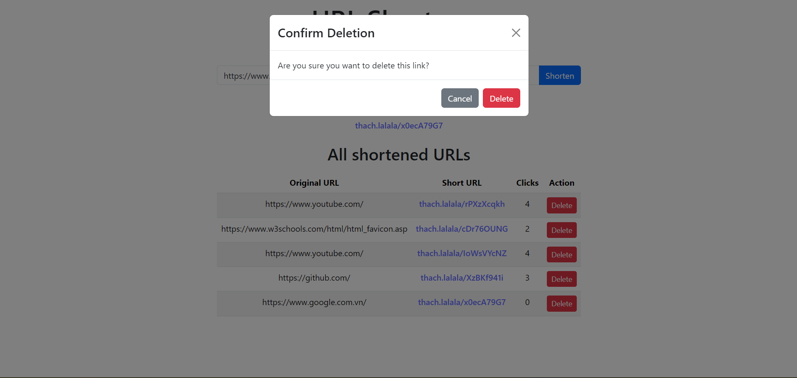

# URL Shortener

This is a simple and efficient URL Shortener application that allows you to convert long URLs into short, manageable links. The shortened URLs are prefixed with "thach.lalala" (my Instagram handle), adding a personal touch to each shortened link.

## Live Demo

You can access the deployed version of this application at:
[https://url-shortener-ui.onrender.com/](https://url-shortener-ui.onrender.com/)

## Images





## Features

- Shorten long URLs to concise, easy-to-share links
- Custom URL prefix: "thach.lalala"
- View a list of all shortened URLs
- Track the number of clicks for each shortened URL
- Delete shortened URLs
- Responsive design for both desktop and mobile use

## Technologies Used

### Frontend

- Vite + React
- React Bootstrap
- Axios for API requests

### Backend

- Node.js
- Express.js
- MongoDB for data storage
- Mongoose for database modeling
- Shortid for generating unique short URLs

## How to Use

1. Visit the [URL Shortener](https://url-shortener-ui.onrender.com/) website.
2. Enter the long URL you wish to shorten in the input field.
3. Click the "Shorten" button.
4. Copy the generated short URL and share it.
5. You can view all shortened URLs, their original long URLs, and click counts in the table below.
6. To delete a shortened URL, click the "Delete" button next to the respective URL in the table.

## Local Development

To set up this project locally for development:

1. Clone the repository:

   ```
   git clone https://github.com/your-username/url-shortener.git
   cd url-shortener
   ```

2. Install dependencies for both frontend and backend:

   ```
   cd frontend
   npm install
   cd ../backend
   npm install
   ```

3. Set up environment variables:
   Create a `.env` file in the backend directory and add your MongoDB connection string:

   ```
   MONGODB_URI=your_mongodb_connection_string
   ```

4. Start the backend server:

   ```
   npm start
   ```

5. In a new terminal, start the frontend development server:

   ```
   cd frontend
   npm run dev
   ```

6. Open your browser and visit `http://localhost:5173` (or the port Vite assigns).

## Contributing

Contributions are welcome! Feel free to fork this project, make improvements, and submit pull requests.

## License

This project is open source and available under the [MIT License](LICENSE).

From Suppleo with <3
